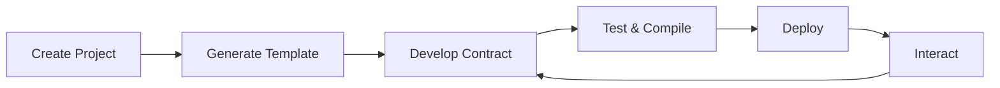

# Quick Start Guide

> **✨ What you'll learn**: How to create, develop, and deploy your first Tari smart contract from scratch

This guide walks you through the complete workflow of Tari smart contract development, from project creation to blockchain deployment.

## Prerequisites

- ✅ **Tari CLI installed** ([Installation Guide](installation.md))
- ✅ **Tari Wallet Daemon running** on `http://127.0.0.1:9000/`
- ✅ **Rust with WASM target** (`rustup target add wasm32-unknown-unknown`)

## Step 1: Create Your Project

Start by creating a new Tari project, which provides the foundation for smart contract development:

<!-- SOURCE: Actual CLI output from README.md:43-57 -->
```bash
tari create my-nft-project
```

**Expected Output**:
```
$ tari create my-nft-project
✅ Init configuration and directories
✅ Refresh project templates repository
✅ Refresh wasm templates repository
✅ Collecting available project templates
🔎 Select project template: Basic - The basic project template to get started on wasm template development.
⠋ Generate new project[1/5] ⠁
✅ Generate new project
```

**What happened?**
- ✅ **Downloaded templates** from the official Tari template repository
- ✅ **Created project structure** with configuration files
- ✅ **Set up Cargo workspace** for managing multiple smart contracts

**Explore your project**:
```bash
cd my-nft-project
ls -la

# You'll see:
# ├── Cargo.toml           # Workspace configuration
# ├── tari.config.toml     # Network settings  
# └── templates/           # Directory for your smart contracts
```

## Step 2: Generate Your First Smart Contract

Now create an NFT smart contract using Tari's built-in templates:

<!-- SOURCE: Actual CLI output from README.md:62-77 -->
```bash
tari new MyNFT
```

**Interactive Selection**:
```
$ tari new MyNFT  
✅ Init configuration and directories
✅ Refresh project templates repository
✅ Refresh wasm templates repository
✅ Collecting available WASM templates
🔎 Select WASM template: NFT - A simple NFT template to create your own.
⠋ Generate new project[ 1/10] ⠁
✅ Generate new project
✅ Update Cargo.toml
```

**What happened?**
- ✅ **Generated NFT contract** from the official template
- ✅ **Updated workspace** to include your new contract
- ✅ **Configured build settings** for WASM compilation

**Explore your smart contract**:
```bash
ls templates/my_nft/

# You'll see:
# ├── Cargo.toml           # Contract dependencies
# ├── src/
# │   └── lib.rs          # Smart contract implementation
# └── README.md           # Template documentation
```

## Step 3: Understand Your Smart Contract

Let's examine the generated NFT contract:

<!-- SOURCE: Template structure verified against template-development-guide.md -->
```bash
cat templates/my_nft/src/lib.rs
```

**Key Components**:
```rust
use tari_template_lib::prelude::*;

#[template]
mod my_nft {
    use super::*;

    #[derive(serde::Serialize, serde::Deserialize)]
    pub struct MyNft {
        // Contract state - stores NFT data
        tokens: BTreeMap<TokenId, NftMetadata>,
        next_token_id: u64,
    }

    impl MyNft {
        // Constructor - initializes the contract
        pub fn new() -> Component<Self> {
            Component::new(Self {
                tokens: BTreeMap::new(),
                next_token_id: 1,
            })
        }

        // Mint new NFT - core functionality
        pub fn mint(&mut self, metadata: NftMetadata) -> TokenId {
            let token_id = self.next_token_id;
            self.tokens.insert(token_id, metadata);
            self.next_token_id += 1;
            token_id
        }

        // Get NFT metadata - read function
        pub fn get_metadata(&self, token_id: &TokenId) -> Option<&NftMetadata> {
            self.tokens.get(token_id)
        }
    }
}
```

**Understanding the Code**:
- `#[template]` - Marks this as a Tari smart contract
- `Component<Self>` - Tari's component system for state management
- `BTreeMap` - Efficient storage for token mappings
- Public methods become the contract's API

## Step 4: Test Compilation

Before deployment, verify your contract compiles correctly:

```bash
cd templates/my_nft

# Test compilation for WASM target
cargo check --target wasm32-unknown-unknown

# Build optimized WASM binary
cargo build --target wasm32-unknown-unknown --release
```

**Expected Output**:
```
   Compiling my_nft v0.1.0 (/path/to/templates/my_nft)
    Finished release [optimized] target(s) in 2.34s
```

**Verify WASM Output**:
```bash
ls target/wasm32-unknown-unknown/release/*.wasm
# Should show: my_nft.wasm
```

## Step 5: Deploy to Tari Network

Deploy your smart contract to the Tari blockchain:

<!-- SOURCE: Actual CLI output from README.md:83-97 -->
```bash
cd ../..  # Return to project root
tari deploy --account myaccount my_nft
```

**Deployment Process**:
```
$ tari deploy --account myaccount my_nft
✅ Init configuration and directories
✅ Refresh project templates repository
✅ Refresh wasm templates repository
✅ Building WASM template project "my_nft"
❓Deploying this template costs 256875 XTR (estimated), are you sure to continue? yes
✅ Deploying project "my_nft" to local network
⭐ Your new template's address: f807989828e70a18050e5785f30a7bd01475797d76d6b4700af175b859c32774
```

**What happened?**
- ✅ **Compiled WASM binary** automatically
- ✅ **Estimated deployment cost** and requested confirmation
- ✅ **Deployed to network** and received contract address
- ✅ **Contract is live** and ready for interaction

## Step 6: Interact With Your Contract

Your NFT contract is now deployed! Here's how applications can interact with it:

**Contract Address**: `f807989828e70a18050e5785f30a7bd01475797d76d6b4700af175b859c32774`

**Available Methods**:
- `new()` - Already called during deployment
- `mint(metadata)` - Create new NFTs
- `get_metadata(token_id)` - Retrieve NFT information

**Next Steps**:
- Build a frontend application to interact with your contract
- Explore other template types (tokens, DeFi protocols)
- Customize your NFT contract with additional features

## Development Workflow Summary

The complete Tari development cycle:



1. **Create Project** - Set up workspace with `tari create`
2. **Generate Template** - Start from proven patterns with `tari new`
3. **Develop Contract** - Implement your business logic
4. **Test & Compile** - Verify WASM compilation
5. **Deploy** - Publish to network with `tari deploy`
6. **Interact** - Build applications that use your contract

## What You've Accomplished

🎉 **Congratulations!** You've successfully:

- ✅ Created a complete Tari development project
- ✅ Generated an NFT smart contract from a template
- ✅ Compiled your contract to WebAssembly
- ✅ Deployed your contract to the Tari blockchain
- ✅ Learned the complete development workflow

## Next Steps

**Enhance Your Contract**:
- **[Template Development Guide](../02-guides/template-development.md)** - Customize and extend your contracts
- **[Configuration Guide](../02-guides/project-configuration.md)** - Configure for different networks
- **[API Patterns](../03-reference/api-patterns.md)** - Learn advanced implementation patterns

**Deploy to Other Networks**:
- **Testnet Deployment** - Test with real network conditions
- **Mainnet Deployment** - Go live for production use

**Build Applications**:
- **Frontend Integration** - Connect web applications to your contracts
- **API Development** - Create backend services that interact with Tari

**Explore More Templates**:
```bash
# See all available templates
tari new --help

# Try different contract types
tari new MyToken      # Fungible token
tari new MyDAO        # Decentralized organization  
tari new MyDEX        # Decentralized exchange
```

## Get Help

- **🐛 Issues**: [GitHub Issues](https://github.com/tari-project/tari-cli/issues)
- **💬 Community**: [Tari Discord](https://discord.gg/tari) 
- **📖 Documentation**: [Complete guides](../README.md)
- **❓ Questions**: [GitHub Discussions](https://github.com/tari-project/tari/discussions)

---
**Ready for more advanced development?** Check out the [Template Development Guide](../02-guides/template-development.md) to learn how to create custom smart contract templates.
