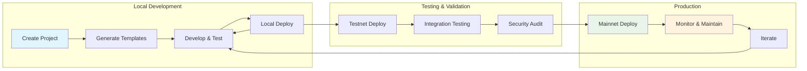

# Development Workflow Guide

> **✨ What you'll learn**: Comprehensive development workflows, from simple prototyping to production deployment

This guide covers the complete spectrum of Tari smart contract development workflows, from rapid prototyping to production-ready applications.

## Development Workflow Overview



## Workflow 1: Rapid Prototyping

**Goal**: Quickly test ideas and validate concepts

### Step 1: Lightning-Fast Project Setup
```bash
# Create project with defaults
tari create my-prototype

cd my-prototype

# Generate multiple templates for comparison
tari new TokenPrototype --template fungible-token
tari new NFTPrototype --template nft
tari new ControllerPrototype --template governance
```

### Step 2: Rapid Iteration Cycle
```bash
# Development loop
while [[ "$DEVELOPING" == "true" ]]; do
    # Edit template code
    code templates/token_prototype/src/lib.rs
    
    # Quick compilation check
    cd templates/token_prototype
    cargo check --target wasm32-unknown-unknown
    
    # Deploy to local network for testing
    cd ../..
    tari deploy --account dev-account --yes token_prototype
    
    # Test functionality (custom testing script)
    ./test-prototype.sh
done
```

### Step 3: Prototype Validation
```bash
# Performance testing
time tari deploy --account dev-account --yes token_prototype

# Feature validation
tari deploy --account test-account --yes nft_prototype
tari deploy --account test-account --yes controller_prototype

# Compare deployment costs
echo "Token deployment cost: [fee from output]"
echo "NFT deployment cost: [fee from output]"
```

**Expected Timeline**: 1-2 hours for complete prototype validation

---

## Workflow 2: Feature Development

**Goal**: Develop new features with proper testing and validation

### Step 1: Feature Planning
```bash
# Create feature-specific project
tari create defi-yield-farming

cd defi-yield-farming

# Set up feature branch structure
git init
git add .
git commit -m "Initial project setup"

# Create feature branch
git checkout -b feature/staking-rewards
```

### Step 2: Template Customization
```bash
# Start with base template
tari new StakingPool --template defi-base

# Customize for specific requirements
cd templates/staking_pool/src

# Key files to modify:
# - lib.rs: Core staking logic
# - rewards.rs: Reward calculation
# - governance.rs: Pool governance
```

### Step 3: Development Environment Setup
```bash
# Configure for development network
cat > tari.config.toml << EOF
[network]
wallet-daemon-jrpc-address = "http://127.0.0.1:9000/"
EOF

# Set up testing environment
mkdir tests
cat > tests/staking_test.rs << 'EOF'
// Integration tests for staking functionality
#[cfg(test)]
mod tests {
    // Test implementations
}
EOF
```

### Step 4: Iterative Development
```bash
# Development cycle
for iteration in {1..5}; do
    echo "=== Development Iteration $iteration ==="
    
    # Code development
    echo "Implementing feature components..."
    
    # Compilation verification
    cargo check --target wasm32-unknown-unknown
    cargo build --target wasm32-unknown-unknown --release
    
    # Local deployment testing
    cd ../..
    tari deploy --account dev-$iteration --yes staking_pool
    
    # Manual testing
    echo "Testing deployment: [template address from output]"
    
    # Commit progress
    git add .
    git commit -m "Iteration $iteration: [describe changes]"
    
    cd templates/staking_pool
done
```

### Step 5: Feature Validation
```bash
# Comprehensive testing
cargo test --all

# Performance benchmarking
time cargo build --target wasm32-unknown-unknown --release

# Security review
cargo audit

# Documentation update
echo "# Staking Pool Feature" > FEATURE.md
echo "Implementation details..." >> FEATURE.md
```

**Expected Timeline**: 1-2 weeks for complete feature development

---

## Workflow 3: Production Deployment

**Goal**: Deploy production-ready templates to mainnet

### Step 1: Pre-Production Preparation
```bash
# Create production project
tari create production-token

cd production-token

# Use proven, audited template
tari new ProductionToken --template audited-token-v2

# Security configuration
cat > tari.config.toml << EOF
[network]
wallet-daemon-jrpc-address = "https://secure-mainnet-wallet:9000/"
EOF
```

### Step 2: Security Audit Preparation
```bash
# Code quality checks
cargo clippy --all-targets --all-features -- -D warnings
cargo fmt --all -- --check

# Dependency audit
cargo audit

# Test coverage verification
cargo install grcov
# [coverage commands]

# Documentation completeness
find . -name "*.rs" -exec grep -l "TODO\|FIXME\|XXX" {} \;
```

### Step 3: Testnet Validation
```bash
# Deploy to testnet first
cat > tari.config.testnet.toml << EOF
[network]
wallet-daemon-jrpc-address = "https://testnet-wallet:9000/"
EOF

# Testnet deployment
tari -c tari.config.testnet.toml deploy --account testnet-production --yes production_token

# Extended testing period
echo "Testnet deployment complete. Monitor for 1 week minimum."
echo "Template address: [address from output]"
```

### Step 4: Mainnet Deployment
```bash
# Final security checklist
echo "Pre-deployment checklist:"
echo "☐ Security audit completed"
echo "☐ Testnet validation successful"
echo "☐ Code review approved"
echo "☐ Documentation complete"
echo "☐ Emergency procedures defined"

# Production deployment
tari deploy --account production-mainnet --max-fee 1000000 production_token

# Post-deployment verification
echo "Production deployment complete!"
echo "Template address: [address from output]"
echo "Begin monitoring and maintenance phase"
```

**Expected Timeline**: 2-4 weeks including security audits

---

## Workflow 4: Multi-Template Projects

**Goal**: Develop complex applications with multiple interacting templates

### Step 1: Project Architecture Planning
```bash
# Create umbrella project
tari create defi-ecosystem

cd defi-ecosystem

# Plan template architecture
mkdir docs
cat > docs/ARCHITECTURE.md << 'EOF'
# DeFi Ecosystem Architecture

## Templates:
1. Base Token (ERC20-like)
2. Liquidity Pool (AMM)
3. Governance Token
4. Staking Rewards
5. Price Oracle

## Interactions:
[Template interaction diagram]
EOF
```

### Step 2: Sequential Template Development
```bash
# Develop templates in dependency order
tari new BaseToken --template fungible-token
tari new GovernanceToken --template governance-token
tari new LiquidityPool --template amm-pool
tari new StakingRewards --template staking
tari new PriceOracle --template oracle

# Verify workspace configuration
cat Cargo.toml
```

### Step 3: Integration Testing
```bash
# Create integration test framework
mkdir integration-tests
cat > integration-tests/ecosystem_test.sh << 'EOF'
#!/bin/bash
set -e

echo "=== DeFi Ecosystem Integration Test ==="

# Deploy all templates
ACCOUNT="integration-test"

echo "Deploying BaseToken..."
BASE_TOKEN=$(tari deploy --account $ACCOUNT --yes base_token | grep "address:" | cut -d' ' -f4)

echo "Deploying GovernanceToken..."
GOVERNANCE_TOKEN=$(tari deploy --account $ACCOUNT --yes governance_token | grep "address:" | cut -d' ' -f4)

echo "Deploying LiquidityPool..."
LIQUIDITY_POOL=$(tari deploy --account $ACCOUNT --yes liquidity_pool | grep "address:" | cut -d' ' -f4)

echo "Deploying StakingRewards..."
STAKING_REWARDS=$(tari deploy --account $ACCOUNT --yes staking_rewards | grep "address:" | cut -d' ' -f4)

echo "Deploying PriceOracle..."
PRICE_ORACLE=$(tari deploy --account $ACCOUNT --yes price_oracle | grep "address:" | cut -d' ' -f4)

echo "=== Deployment Summary ==="
echo "BaseToken: $BASE_TOKEN"
echo "GovernanceToken: $GOVERNANCE_TOKEN"
echo "LiquidityPool: $LIQUIDITY_POOL"
echo "StakingRewards: $STAKING_REWARDS"
echo "PriceOracle: $PRICE_ORACLE"

echo "Integration deployment complete!"
EOF

chmod +x integration-tests/ecosystem_test.sh
```

### Step 4: Coordinated Deployment
```bash
# Run integration test
./integration-tests/ecosystem_test.sh

# Monitor all templates
echo "All ecosystem components deployed successfully"
echo "Begin cross-template interaction testing"
```

**Expected Timeline**: 4-8 weeks for complete ecosystem

---

## Workflow 5: CI/CD Integration

**Goal**: Automate development, testing, and deployment processes

### Step 1: CI/CD Setup
```bash
# Create GitHub Actions workflow
mkdir -p .github/workflows
cat > .github/workflows/ci.yml << 'EOF'
name: Tari Template CI/CD

on:
  push:
    branches: [ main, develop ]
  pull_request:
    branches: [ main ]

jobs:
  test:
    runs-on: ubuntu-latest
    steps:
      - uses: actions/checkout@v4
      
      - name: Setup Rust
        uses: dtolnay/rust-toolchain@stable
        with:
          targets: wasm32-unknown-unknown
          
      - name: Install Tari CLI
        run: cargo install tari-cli --git https://github.com/tari-project/tari-cli
        
      - name: Test Template Compilation
        run: |
          for template in templates/*/; do
            cd "$template"
            cargo check --target wasm32-unknown-unknown
            cargo build --target wasm32-unknown-unknown --release
            cd ../..
          done
          
      - name: Test Template Deployment (Dry Run)
        run: |
          # Configure for CI environment
          echo '[network]' > tari.config.toml
          echo 'wallet-daemon-jrpc-address = "http://ci-wallet:9000/"' >> tari.config.toml
          
          # Test deployment process (without actual deployment)
          # tari deploy --account ci-test --dry-run template-name

  deploy-testnet:
    needs: test
    runs-on: ubuntu-latest
    if: github.ref == 'refs/heads/develop'
    steps:
      - uses: actions/checkout@v4
      
      - name: Deploy to Testnet
        run: |
          # Automated testnet deployment
          tari deploy --account testnet-ci --yes primary-template
          
  deploy-mainnet:
    needs: test
    runs-on: ubuntu-latest
    if: github.ref == 'refs/heads/main'
    environment: production
    steps:
      - name: Deploy to Mainnet
        run: |
          # Production deployment with manual approval
          tari deploy --account mainnet-production --yes primary-template
EOF
```

### Step 2: Automated Testing
```bash
# Create comprehensive test suite
mkdir -p tests/automated
cat > tests/automated/template_validation.sh << 'EOF'
#!/bin/bash
set -e

echo "=== Automated Template Validation ==="

# Test all templates compile
for template_dir in templates/*/; do
    template_name=$(basename "$template_dir")
    echo "Testing template: $template_name"
    
    cd "$template_dir"
    
    # Compilation test
    cargo check --target wasm32-unknown-unknown
    if [ $? -eq 0 ]; then
        echo "✅ $template_name compilation: PASS"
    else
        echo "❌ $template_name compilation: FAIL"
        exit 1
    fi
    
    # WASM build test
    cargo build --target wasm32-unknown-unknown --release
    if [ $? -eq 0 ]; then
        echo "✅ $template_name WASM build: PASS"
    else
        echo "❌ $template_name WASM build: FAIL"
        exit 1
    fi
    
    cd ../..
done

echo "All template validation tests passed!"
EOF

chmod +x tests/automated/template_validation.sh
```

**Expected Timeline**: 1-2 days for complete CI/CD setup

---

## Development Best Practices

### Code Organization
```bash
# Recommended project structure
my-project/
├── Cargo.toml              # Workspace configuration
├── tari.config.toml        # Network configuration
├── docs/                   # Project documentation
│   ├── ARCHITECTURE.md     # System design
│   ├── DEPLOYMENT.md       # Deployment procedures
│   └── API.md             # Template APIs
├── templates/              # Smart contract templates
│   ├── core/              # Core business logic
│   ├── governance/        # Governance mechanisms
│   └── utilities/         # Helper contracts
├── tests/                  # Test suites
│   ├── unit/              # Unit tests
│   ├── integration/       # Integration tests
│   └── automated/         # CI/CD test scripts
└── scripts/               # Development utilities
    ├── deploy.sh          # Deployment automation
    ├── test.sh            # Testing automation
    └── monitor.sh         # Post-deployment monitoring
```

### Version Control Strategy
```bash
# Git workflow for template development
git flow init

# Feature development
git flow feature start new-staking-mechanism
# [development work]
git flow feature finish new-staking-mechanism

# Release preparation
git flow release start v1.2.0
# [testing and validation]
git flow release finish v1.2.0

# Hotfix for production
git flow hotfix start critical-security-fix
# [emergency fixes]
git flow hotfix finish critical-security-fix
```

### Testing Strategy
```bash
# Multi-level testing approach

# 1. Unit tests (per template)
cd templates/my-template
cargo test

# 2. Integration tests (template interactions)
cargo test --test integration_tests

# 3. End-to-end tests (full deployment)
./tests/automated/e2e_test.sh

# 4. Load testing (performance validation)
./scripts/load_test.sh

# 5. Security testing (vulnerability assessment)
cargo audit
./security/audit_script.sh
```

### Monitoring and Maintenance
```bash
# Post-deployment monitoring script
cat > scripts/monitor.sh << 'EOF'
#!/bin/bash

TEMPLATE_ADDRESS="your-template-address"
NETWORK_ENDPOINT="https://tari-network-api/templates"

echo "=== Template Monitoring Dashboard ==="

# Check template status
curl -s "$NETWORK_ENDPOINT/$TEMPLATE_ADDRESS" | jq '.status'

# Monitor transaction volume
curl -s "$NETWORK_ENDPOINT/$TEMPLATE_ADDRESS/transactions" | jq '.count'

# Check error rates
curl -s "$NETWORK_ENDPOINT/$TEMPLATE_ADDRESS/errors" | jq '.error_rate'

# Performance metrics
curl -s "$NETWORK_ENDPOINT/$TEMPLATE_ADDRESS/metrics" | jq '.performance'

echo "Monitoring complete. Template is healthy."
EOF

chmod +x scripts/monitor.sh
```

## Troubleshooting Common Workflow Issues

### Issue 1: Template Compilation Failures
```bash
# Debug compilation issues
cd templates/problematic-template

# Check for common issues
cargo check --target wasm32-unknown-unknown 2>&1 | tee compile_errors.log

# Common fixes
rustup target add wasm32-unknown-unknown
cargo clean
cargo update
```

### Issue 2: Deployment Network Issues
```bash
# Network connectivity debugging
curl -v http://127.0.0.1:9000/

# Configuration verification
cat tari.config.toml

# Alternative network testing
tari deploy --account test-account --custom-network testnet my-template
```

### Issue 3: Workspace Management
```bash
# Cargo workspace issues
cargo check --workspace

# Fix workspace configuration
cat > Cargo.toml << 'EOF'
[workspace]
members = [
    "templates/*"
]
resolver = "2"
EOF
```

---

**Ready to implement your workflow?** Choose the workflow that matches your project needs and follow the step-by-step instructions. For additional help, see our [Troubleshooting Guide](../04-troubleshooting/common-issues.md) or [CLI Commands Reference](../03-reference/cli-commands.md).
