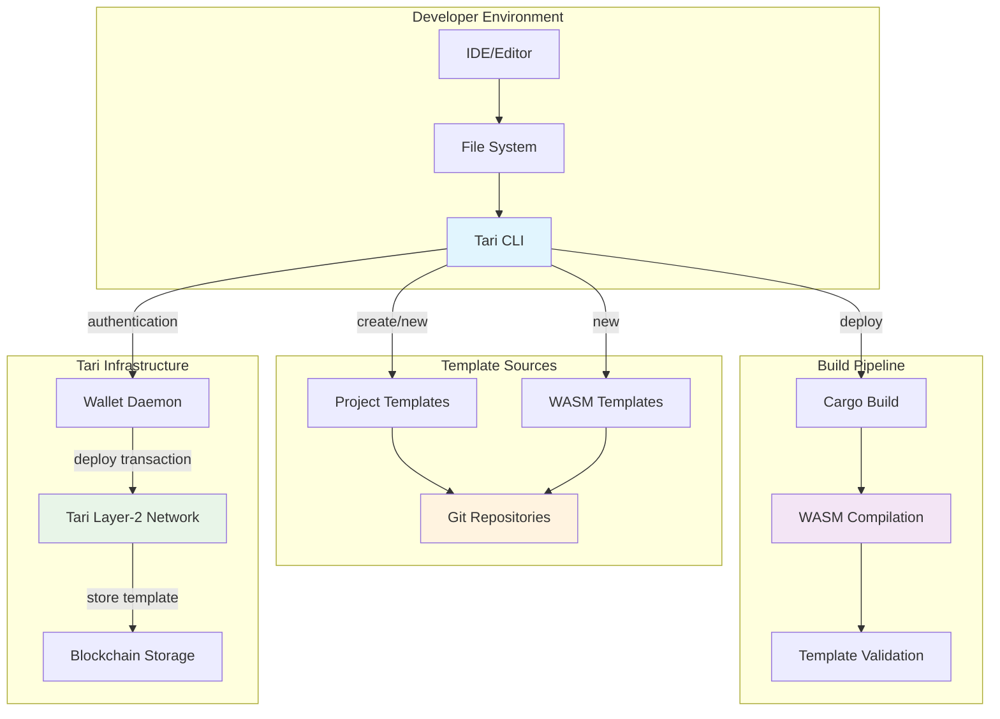
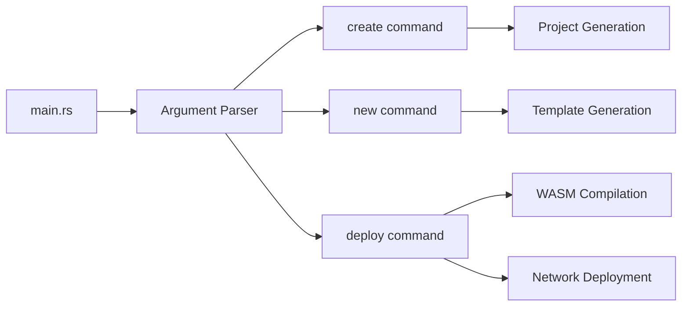
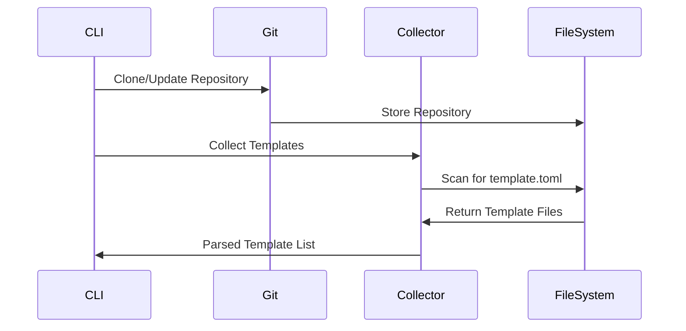
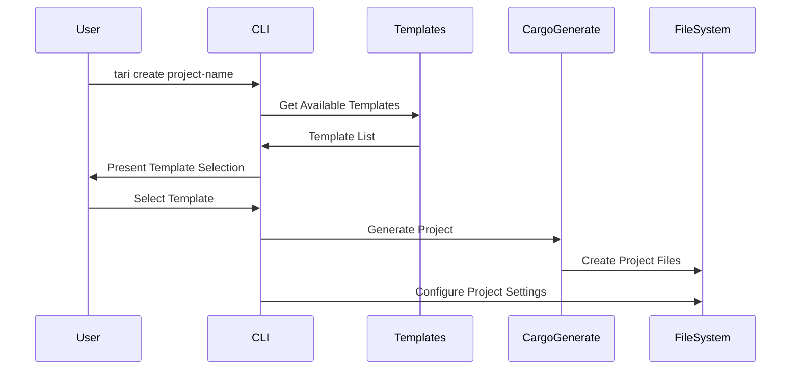
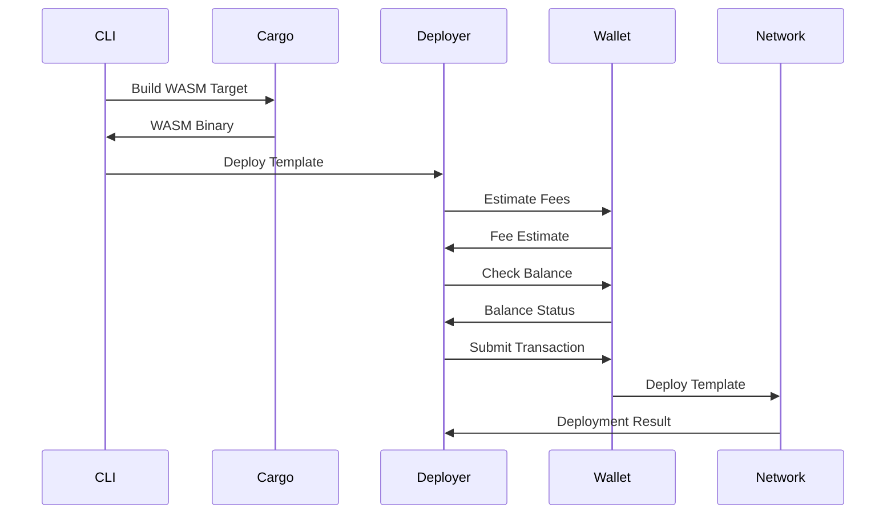
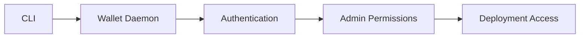

# Tari CLI Architecture

This document provides a comprehensive overview of the Tari CLI architecture, design patterns, and component interactions.

## System Overview

The Tari CLI is a command-line tool for developing Tari smart contracts (called "templates"). It provides a complete development workflow from project creation to template deployment on the Tari Layer-2 blockchain network.

### High-Level Architecture



### Core Value Proposition

The Tari CLI transforms complex blockchain development into a streamlined workflow:

1. **Template-Driven Development**: Start from proven patterns rather than blank files
2. **Automated Build Pipeline**: WASM compilation and validation handled automatically  
3. **Integrated Deployment**: Direct deployment to Tari networks with cost estimation
4. **Developer Experience**: Rich terminal UI with progress feedback and error guidance

## Core Architecture

### Crate Structure

```
tari-cli-work/
└── crates/
    ├── cli/                    # Main CLI application
    │   ├── src/
    │   │   ├── cli/           # Command parsing and configuration
    │   │   ├── templates/     # Template discovery and management
    │   │   ├── project/       # Project configuration
    │   │   └── git/           # Git repository operations
    │   └── Cargo.toml
    └── tari_deploy/           # Deployment library
        ├── src/
        │   └── deployer.rs    # Template deployment logic
        └── Cargo.toml
```

### Command Architecture

The CLI uses a command-based architecture with three primary operations:



## Component Details

### 1. Command Line Interface Layer

**Location**: `crates/cli/src/cli/`

**Responsibilities**:
- Argument parsing using `clap`
- Configuration management
- User interaction and feedback
- Command routing and execution

**Key Files**:
- `arguments.rs`: CLI argument definitions and parsing
- `config.rs`: CLI configuration management
- `util.rs`: Shared utilities and UI helpers

<!-- SOURCE: crates/cli/src/cli/arguments.rs -->
**Command Structure**:
```rust
#[derive(Parser)]
pub enum Commands {
    Create(CreateArgs),
    New(NewArgs),
    Deploy(DeployArgs),
}
```

### 2. Template Management System

**Location**: `crates/cli/src/templates/`

**Responsibilities**:
- Template discovery from Git repositories
- Template metadata parsing
- Template collection and categorization
- Integration with cargo-generate

**Key Components**:

<!-- SOURCE: crates/cli/src/templates/collector.rs:174-179 -->
**Template Collector**:
```rust
// VERIFIED: 2025-06-26 from test implementation
pub struct Collector {
    repository_path: PathBuf,
}

impl Collector {
    pub async fn collect(&self) -> Result<Vec<Template>, Error> {
        // Scans for template.toml files and builds template list
    }
}
```

**Template Discovery Process**:
1. Git repository cloning/updating
2. Recursive scanning for `template.toml` descriptors
3. Template metadata validation
4. Template categorization (project vs WASM)

### 3. Project Configuration Management

**Location**: `crates/cli/src/project/`

**Responsibilities**:
- Project-level configuration handling
- Network configuration management
- Workspace integration

<!-- SOURCE: crates/cli/src/project/config.rs:16-33 -->
**Configuration Structure**:
```rust
// VERIFIED: 2025-06-26
#[derive(Clone, Debug, Serialize, Deserialize)]
pub struct Config {
    network: NetworkConfig,
}

impl Default for Config {
    fn default() -> Self {
        Self {
            network: NetworkConfig::new(
                Url::parse("http://127.0.0.1:9000").unwrap()
            ),
        }
    }
}
```

### 4. Git Repository Operations

**Location**: `crates/cli/src/git/`

**Responsibilities**:
- Repository cloning and updates
- Branch management
- Template repository synchronization

**Operations**:
- Clone template repositories
- Pull latest changes
- Switch branches as needed
- Manage repository caching

### 5. Template Deployment Engine

**Location**: `crates/tari_deploy/`

**Responsibilities**:
- WASM compilation and validation
- Fee estimation and balance verification
- Wallet daemon communication
- Network deployment orchestration

**Deployment Pipeline**:
1. **Compilation**: Build WASM targets
2. **Validation**: Verify WASM binary integrity
3. **Fee Estimation**: Calculate deployment costs
4. **Balance Check**: Verify account funds
5. **Deployment**: Submit to Tari network
6. **Monitoring**: Track deployment status

## Data Flow Architecture

### Template Discovery Flow



### Project Creation Flow



### Deployment Flow



## Configuration Architecture

### Multi-Level Configuration

The CLI supports configuration at multiple levels:

1. **Default Configuration**: Hard-coded defaults
2. **Global CLI Configuration**: User-specific settings
3. **Project Configuration**: Project-specific settings
4. **Command-Line Overrides**: Runtime parameter overrides

### Configuration Precedence

```
Command Line Args > Project Config > CLI Config > Defaults
```

### Configuration Files

- **CLI Config**: `~/.tari-cli/config.toml` (if exists)
- **Project Config**: `project_dir/tari.config.toml`

## Error Handling Strategy

### Error Types

The CLI uses structured error handling with `thiserror` and `anyhow`:

```rust
// Domain-specific errors
#[derive(Error, Debug)]
pub enum CreateHandlerError {
    #[error("Template not found by name: {0}. Possible values: {1:?}")]
    TemplateNotFound(String, Vec<String>),
}

// Context-aware error propagation
pub type Result<T> = anyhow::Result<T>;
```

### Error Propagation

1. **Domain Errors**: Specific error types for each domain
2. **Context Addition**: Adding context during error propagation
3. **User-Friendly Messages**: Converting technical errors to user messages
4. **Graceful Degradation**: Handling non-critical failures

## Async Architecture

### Async Runtime

The CLI uses Tokio for async operations:

```rust
#[tokio::main]
async fn main() -> anyhow::Result<()> {
    // Async CLI operations
}
```

### Async Operations

- **File I/O**: All file operations are async
- **Network Requests**: Git operations and wallet communication
- **Template Processing**: Concurrent template discovery
- **Build Operations**: Async cargo build execution

## User Interface Architecture

### Terminal UI Components

- **Progress Indicators**: Spinners for long-running operations
- **Interactive Selection**: Template and option selection dialogs
- **Rich Output**: Markdown-formatted help and status messages
- **Color Themes**: Consistent magenta-based color scheme

### UI Libraries

- **termimad**: Markdown rendering in terminal
- **dialoguer**: Interactive prompts and selections
- **clap**: Command-line argument parsing
- **spinners**: Loading indicators

## Security Architecture

### Authentication Flow



### Security Considerations

1. **Wallet Authentication**: Secure connection to wallet daemon
2. **Admin Permissions**: Required for template deployment
3. **HTTPS Support**: Secure network communication
4. **Input Validation**: Parameter and configuration validation
5. **Secret Management**: No secrets stored in CLI configuration

## Extension Points

### Plugin Architecture

While not currently implemented, the architecture supports future extensions:

1. **Custom Commands**: Additional command implementations
2. **Template Sources**: Alternative template repositories
3. **Deployment Targets**: Additional network configurations
4. **Build Systems**: Alternative compilation pipelines

### Customization Options

1. **Template Repositories**: Configurable template sources
2. **Network Endpoints**: Custom wallet daemon addresses
3. **Build Configuration**: Cargo build customization
4. **UI Themes**: Customizable color schemes and output formats

## Performance Considerations

### Optimization Strategies

1. **Concurrent Operations**: Parallel template discovery and processing
2. **Repository Caching**: Local caching of template repositories
3. **Incremental Updates**: Only update repositories when needed
4. **Lazy Loading**: Load templates on demand
5. **Build Optimization**: Efficient WASM compilation

### Resource Management

1. **Memory Usage**: Efficient template metadata storage
2. **Disk Usage**: Repository cleanup and management
3. **Network Usage**: Minimal repository synchronization
4. **CPU Usage**: Optimized build and compilation processes

## Testing Architecture

### Test Organization

<!-- SOURCE: crates/cli/src/templates/collector.rs:91-200 -->
```rust
// VERIFIED: 2025-06-26
#[cfg(test)]
mod tests {
    use super::*;
    use tempdir::TempDir;
    
    #[tokio::test]
    async fn test_collect() {
        // Template collection testing
    }
}
```

### Testing Strategy

1. **Unit Tests**: Component-level testing
2. **Integration Tests**: End-to-end workflow testing
3. **Mock Testing**: External dependency mocking
4. **Property Testing**: Template validation testing

## Future Architecture Considerations

### Scalability

- **Multi-Repository Support**: Enhanced template source management
- **Parallel Deployment**: Concurrent template deployments
- **Caching Improvements**: Enhanced repository and build caching

### Extensibility

- **Plugin System**: Dynamic command and feature loading
- **API Integration**: REST API for programmatic access
- **IDE Integration**: Language server protocol support
- **CI/CD Integration**: Enhanced automation support

This architecture provides a solid foundation for Tari smart contract development while maintaining flexibility for future enhancements and extensions.
