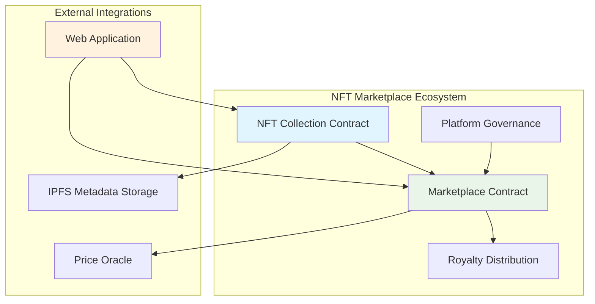

# Real-World Examples & Use Cases

> **Production-ready examples** for common blockchain application patterns using Tari CLI

## Overview

This guide provides complete, production-ready examples for building real-world blockchain applications with Tari CLI. Each example includes full project setup, implementation, deployment, and monitoring.

---

## Example 1: NFT Marketplace Platform

**Use Case**: Complete NFT marketplace with minting, trading, and royalty distribution

### Project Architecture



### Implementation

**Step 1: Project Setup**
```bash
# Create NFT marketplace project
tari create nft-marketplace-platform

cd nft-marketplace-platform

# Configure for testnet deployment
cat > tari.config.toml << EOF
[network]
wallet-daemon-jrpc-address = "https://testnet-wallet.tari.com:9000/"
EOF
```

**Step 2: Core Template Generation**
```bash
# Generate marketplace components
tari new NFTCollection --template nft-advanced
tari new MarketplaceCore --template marketplace
tari new RoyaltyDistributor --template payment-splitter
tari new PlatformGovernance --template governance-dao

# Verify workspace configuration
cat Cargo.toml
```

**Step 3: Template Customization**

**NFT Collection (templates/nft_collection/src/lib.rs)**:
```rust
use tari_template_lib::prelude::*;

#[template]
mod nft_collection {
    use super::*;
    
    #[derive(serde::Serialize, serde::Deserialize)]
    pub struct NFTCollection {
        tokens: BTreeMap<TokenId, NFTMetadata>,
        next_token_id: u64,
        collection_info: CollectionInfo,
        royalty_rate: u32, // Basis points (e.g., 250 = 2.5%)
        creator: ComponentAddress,
    }
    
    #[derive(serde::Serialize, serde::Deserialize)]
    pub struct NFTMetadata {
        name: String,
        description: String,
        image_url: String,
        attributes: Vec<Attribute>,
        creator: ComponentAddress,
        created_at: u64,
    }
    
    #[derive(serde::Serialize, serde::Deserialize)]
    pub struct Attribute {
        trait_type: String,
        value: String,
    }
    
    impl NFTCollection {
        pub fn new(
            name: String,
            symbol: String,
            base_uri: String,
            royalty_rate: u32,
        ) -> Component<Self> {
            Component::new(Self {
                tokens: BTreeMap::new(),
                next_token_id: 1,
                collection_info: CollectionInfo {
                    name,
                    symbol,
                    base_uri,
                    total_supply: 0,
                },
                royalty_rate,
                creator: Runtime::caller(),
            })
        }
        
        pub fn mint_nft(
            &mut self,
            to: ComponentAddress,
            metadata: NFTMetadata,
        ) -> TokenId {
            let token_id = self.next_token_id;
            
            self.tokens.insert(token_id, metadata);
            self.next_token_id += 1;
            self.collection_info.total_supply += 1;
            
            // Emit mint event
            Runtime::emit_event("NFTMinted", NFTMintedEvent {
                token_id,
                to,
                creator: self.creator,
            });
            
            token_id
        }
        
        pub fn transfer(
            &mut self,
            from: ComponentAddress,
            to: ComponentAddress,
            token_id: TokenId,
        ) -> bool {
            // Verify ownership and execute transfer
            if self.owner_of(token_id) == Some(from) {
                // Transfer logic
                Runtime::emit_event("NFTTransferred", NFTTransferEvent {
                    from,
                    to,
                    token_id,
                });
                true
            } else {
                false
            }
        }
        
        pub fn get_royalty_info(&self, sale_price: u64) -> (ComponentAddress, u64) {
            let royalty_amount = (sale_price * self.royalty_rate as u64) / 10000;
            (self.creator, royalty_amount)
        }
    }
}
```

**Step 4: Marketplace Implementation**

**Marketplace Core (templates/marketplace_core/src/lib.rs)**:
```rust
use tari_template_lib::prelude::*;

#[template]
mod marketplace_core {
    use super::*;
    
    #[derive(serde::Serialize, serde::Deserialize)]
    pub struct MarketplaceCore {
        listings: BTreeMap<ListingId, Listing>,
        next_listing_id: u64,
        platform_fee_rate: u32, // Basis points
        platform_fee_recipient: ComponentAddress,
        approved_collections: BTreeSet<ComponentAddress>,
    }
    
    #[derive(serde::Serialize, serde::Deserialize)]
    pub struct Listing {
        seller: ComponentAddress,
        collection: ComponentAddress,
        token_id: TokenId,
        price: u64,
        currency: ResourceAddress,
        expiry: u64,
        status: ListingStatus,
    }
    
    impl MarketplaceCore {
        pub fn new(platform_fee_rate: u32) -> Component<Self> {
            Component::new(Self {
                listings: BTreeMap::new(),
                next_listing_id: 1,
                platform_fee_rate,
                platform_fee_recipient: Runtime::caller(),
                approved_collections: BTreeSet::new(),
            })
        }
        
        pub fn create_listing(
            &mut self,
            collection: ComponentAddress,
            token_id: TokenId,
            price: u64,
            currency: ResourceAddress,
            duration: u64,
        ) -> ListingId {
            // Verify collection is approved
            assert!(
                self.approved_collections.contains(&collection),
                "Collection not approved for marketplace"
            );
            
            let listing_id = self.next_listing_id;
            let expiry = Runtime::current_epoch() + duration;
            
            let listing = Listing {
                seller: Runtime::caller(),
                collection,
                token_id,
                price,
                currency,
                expiry,
                status: ListingStatus::Active,
            };
            
            self.listings.insert(listing_id, listing);
            self.next_listing_id += 1;
            
            Runtime::emit_event("ListingCreated", ListingCreatedEvent {
                listing_id,
                seller: Runtime::caller(),
                collection,
                token_id,
                price,
            });
            
            listing_id
        }
        
        pub fn purchase_nft(
            &mut self,
            listing_id: ListingId,
            payment: Bucket,
        ) -> (Bucket, Bucket) {
            let listing = self.listings.get_mut(&listing_id)
                .expect("Listing not found");
            
            assert!(listing.status == ListingStatus::Active, "Listing not active");
            assert!(Runtime::current_epoch() <= listing.expiry, "Listing expired");
            assert!(payment.amount() >= listing.price, "Insufficient payment");
            
            // Calculate fees
            let platform_fee = (listing.price * self.platform_fee_rate as u64) / 10000;
            let seller_amount = listing.price - platform_fee;
            
            // Handle royalties (call to NFT collection contract)
            let (royalty_recipient, royalty_amount) = self.get_royalty_info(
                listing.collection,
                listing.price
            );
            
            let final_seller_amount = seller_amount - royalty_amount;
            
            // Execute transfers
            let platform_fee_bucket = payment.take(platform_fee);
            let royalty_bucket = payment.take(royalty_amount);
            let seller_bucket = payment.take(final_seller_amount);
            let refund_bucket = payment; // Remaining amount as refund
            
            // Transfer NFT ownership
            self.transfer_nft_ownership(
                listing.collection,
                listing.token_id,
                listing.seller,
                Runtime::caller(),
            );
            
            listing.status = ListingStatus::Sold;
            
            Runtime::emit_event("NFTPurchased", NFTPurchasedEvent {
                listing_id,
                buyer: Runtime::caller(),
                seller: listing.seller,
                price: listing.price,
            });
            
            (seller_bucket, refund_bucket)
        }
    }
}
```

**Step 5: Deployment & Configuration**
```bash
# Deploy contracts in dependency order
echo "=== NFT Marketplace Deployment ==="

# 1. Deploy NFT Collection template
COLLECTION_ADDR=$(tari deploy --account marketplace-admin --yes nft_collection | grep "address:" | cut -d' ' -f4)
echo "NFT Collection deployed: $COLLECTION_ADDR"

# 2. Deploy Marketplace Core
MARKETPLACE_ADDR=$(tari deploy --account marketplace-admin --yes marketplace_core | grep "address:" | cut -d' ' -f4)
echo "Marketplace Core deployed: $MARKETPLACE_ADDR"

# 3. Deploy Royalty Distributor
ROYALTY_ADDR=$(tari deploy --account marketplace-admin --yes royalty_distributor | grep "address:" | cut -d' ' -f4)
echo "Royalty Distributor deployed: $ROYALTY_ADDR"

# 4. Deploy Platform Governance
GOVERNANCE_ADDR=$(tari deploy --account marketplace-admin --yes platform_governance | grep "address:" | cut -d' ' -f4)
echo "Platform Governance deployed: $GOVERNANCE_ADDR"

echo "=== Deployment Complete ==="
echo "Collection: $COLLECTION_ADDR"
echo "Marketplace: $MARKETPLACE_ADDR"
echo "Royalty: $ROYALTY_ADDR"
echo "Governance: $GOVERNANCE_ADDR"
```

---

## Example 2: DeFi Yield Farming Protocol

**Use Case**: Yield farming protocol with liquidity pools, staking rewards, and governance

### Project Setup
```bash
# Create DeFi protocol project
tari create defi-yield-protocol

cd defi-yield-protocol

# Generate core DeFi components
tari new LiquidityPool --template amm-pool
tari new YieldFarm --template staking-rewards
tari new GovernanceToken --template governance-token
tari new RewardsDistributor --template rewards-distributor
tari new PriceOracle --template chainlink-oracle
```

### Core Implementation

**Yield Farm Contract (templates/yield_farm/src/lib.rs)**:
```rust
use tari_template_lib::prelude::*;

#[template]
mod yield_farm {
    use super::*;
    
    #[derive(serde::Serialize, serde::Deserialize)]
    pub struct YieldFarm {
        // Staking pools configuration
        pools: BTreeMap<PoolId, StakingPool>,
        next_pool_id: u64,
        
        // Global rewards configuration
        total_rewards_per_block: u64,
        last_update_block: u64,
        
        // User stakes and rewards
        user_stakes: BTreeMap<(ComponentAddress, PoolId), UserStake>,
        pending_rewards: BTreeMap<ComponentAddress, u64>,
        
        // Governance and admin
        owner: ComponentAddress,
        reward_token: ResourceAddress,
        governance_token: ResourceAddress,
    }
    
    #[derive(serde::Serialize, serde::Deserialize)]
    pub struct StakingPool {
        staking_token: ResourceAddress,
        allocation_points: u64,
        last_reward_block: u64,
        accumulated_rewards_per_share: u64,
        total_staked: u64,
        minimum_stake: u64,
        lock_period: u64,
    }
    
    impl YieldFarm {
        pub fn new(
            reward_token: ResourceAddress,
            governance_token: ResourceAddress,
            rewards_per_block: u64,
        ) -> Component<Self> {
            Component::new(Self {
                pools: BTreeMap::new(),
                next_pool_id: 0,
                total_rewards_per_block: rewards_per_block,
                last_update_block: Runtime::current_epoch(),
                user_stakes: BTreeMap::new(),
                pending_rewards: BTreeMap::new(),
                owner: Runtime::caller(),
                reward_token,
                governance_token,
            })
        }
        
        pub fn add_pool(
            &mut self,
            staking_token: ResourceAddress,
            allocation_points: u64,
            minimum_stake: u64,
            lock_period: u64,
        ) -> PoolId {
            self.require_owner();
            
            let pool_id = self.next_pool_id;
            
            let pool = StakingPool {
                staking_token,
                allocation_points,
                last_reward_block: Runtime::current_epoch(),
                accumulated_rewards_per_share: 0,
                total_staked: 0,
                minimum_stake,
                lock_period,
            };
            
            self.pools.insert(pool_id, pool);
            self.next_pool_id += 1;
            
            Runtime::emit_event("PoolAdded", PoolAddedEvent {
                pool_id,
                staking_token,
                allocation_points,
            });
            
            pool_id
        }
        
        pub fn stake(&mut self, pool_id: PoolId, amount: Bucket) -> Bucket {
            let mut pool = self.pools.get_mut(&pool_id)
                .expect("Pool not found");
            
            assert!(amount.resource_address() == pool.staking_token, "Invalid token");
            assert!(amount.amount() >= pool.minimum_stake, "Below minimum stake");
            
            // Update pool rewards before modifying stake
            self.update_pool_rewards(pool_id);
            
            let user = Runtime::caller();
            let stake_key = (user, pool_id);
            
            // Calculate pending rewards for existing stake
            if let Some(existing_stake) = self.user_stakes.get(&stake_key) {
                let pending = self.calculate_pending_rewards(pool_id, &existing_stake);
                self.pending_rewards.entry(user)
                    .and_modify(|e| *e += pending)
                    .or_insert(pending);
            }
            
            // Update user stake
            let new_stake = UserStake {
                amount: self.user_stakes.get(&stake_key)
                    .map(|s| s.amount + amount.amount())
                    .unwrap_or(amount.amount()),
                reward_debt: (self.user_stakes.get(&stake_key)
                    .map(|s| s.amount + amount.amount())
                    .unwrap_or(amount.amount()) * pool.accumulated_rewards_per_share) / 1e12 as u64,
                stake_time: Runtime::current_epoch(),
                unlock_time: Runtime::current_epoch() + pool.lock_period,
            };
            
            self.user_stakes.insert(stake_key, new_stake);
            pool.total_staked += amount.amount();
            
            Runtime::emit_event("Staked", StakeEvent {
                user,
                pool_id,
                amount: amount.amount(),
            });
            
            // Return empty bucket (tokens are consumed)
            Bucket::new(pool.staking_token)
        }
        
        pub fn unstake(&mut self, pool_id: PoolId, amount: u64) -> Bucket {
            let user = Runtime::caller();
            let stake_key = (user, pool_id);
            
            let user_stake = self.user_stakes.get_mut(&stake_key)
                .expect("No stake found");
            
            assert!(Runtime::current_epoch() >= user_stake.unlock_time, "Stake still locked");
            assert!(user_stake.amount >= amount, "Insufficient stake");
            
            // Update rewards and withdraw
            self.update_pool_rewards(pool_id);
            let pending = self.calculate_pending_rewards(pool_id, user_stake);
            
            if pending > 0 {
                self.pending_rewards.entry(user)
                    .and_modify(|e| *e += pending)
                    .or_insert(pending);
            }
            
            // Update stake
            user_stake.amount -= amount;
            let pool = self.pools.get_mut(&pool_id).unwrap();
            pool.total_staked -= amount;
            
            // Create return bucket
            let return_bucket = Bucket::new(pool.staking_token);
            // Note: In real implementation, this would withdraw from vault
            
            Runtime::emit_event("Unstaked", UnstakeEvent {
                user,
                pool_id,
                amount,
            });
            
            return_bucket
        }
        
        pub fn claim_rewards(&mut self) -> Bucket {
            let user = Runtime::caller();
            
            // Update all pools and calculate total pending rewards
            let mut total_rewards = self.pending_rewards.get(&user).copied().unwrap_or(0);
            
            for (pool_id, _) in &self.pools.clone() {
                if let Some(stake) = self.user_stakes.get(&(user, *pool_id)) {
                    self.update_pool_rewards(*pool_id);
                    total_rewards += self.calculate_pending_rewards(*pool_id, stake);
                }
            }
            
            assert!(total_rewards > 0, "No rewards to claim");
            
            // Reset pending rewards
            self.pending_rewards.remove(&user);
            
            // Create rewards bucket
            let rewards_bucket = Bucket::new(self.reward_token);
            // Note: In real implementation, this would mint or withdraw from vault
            
            Runtime::emit_event("RewardsClaimed", RewardsClaimedEvent {
                user,
                amount: total_rewards,
            });
            
            rewards_bucket
        }
        
        fn update_pool_rewards(&mut self, pool_id: PoolId) {
            let mut pool = self.pools.get_mut(&pool_id).unwrap();
            let current_block = Runtime::current_epoch();
            
            if current_block <= pool.last_reward_block {
                return;
            }
            
            if pool.total_staked == 0 {
                pool.last_reward_block = current_block;
                return;
            }
            
            let blocks_elapsed = current_block - pool.last_reward_block;
            let total_allocation_points = self.get_total_allocation_points();
            
            let pool_reward = (blocks_elapsed * self.total_rewards_per_block * pool.allocation_points) 
                / total_allocation_points;
            
            pool.accumulated_rewards_per_share += (pool_reward * 1e12 as u64) / pool.total_staked;
            pool.last_reward_block = current_block;
        }
    }
}
```

### Deployment Strategy
```bash
# Complete DeFi protocol deployment
cat > scripts/deploy_defi.sh << 'EOF'
#!/bin/bash
set -e

echo "=== DeFi Yield Protocol Deployment ==="

ADMIN_ACCOUNT="defi-admin"
NETWORK="testnet"

# Deploy governance token first
echo "Deploying Governance Token..."
GOVERNANCE_TOKEN=$(tari deploy --account $ADMIN_ACCOUNT --custom-network $NETWORK --yes governance_token | grep "address:" | cut -d' ' -f4)

# Deploy reward token
echo "Deploying Reward Token..."
REWARD_TOKEN=$(tari deploy --account $ADMIN_ACCOUNT --custom-network $NETWORK --yes reward_token | grep "address:" | cut -d' ' -f4)

# Deploy price oracle
echo "Deploying Price Oracle..."
PRICE_ORACLE=$(tari deploy --account $ADMIN_ACCOUNT --custom-network $NETWORK --yes price_oracle | grep "address:" | cut -d' ' -f4)

# Deploy liquidity pools
echo "Deploying Liquidity Pool..."
LIQUIDITY_POOL=$(tari deploy --account $ADMIN_ACCOUNT --custom-network $NETWORK --yes liquidity_pool | grep "address:" | cut -d' ' -f4)

# Deploy yield farm
echo "Deploying Yield Farm..."
YIELD_FARM=$(tari deploy --account $ADMIN_ACCOUNT --custom-network $NETWORK --yes yield_farm | grep "address:" | cut -d' ' -f4)

# Deploy rewards distributor
echo "Deploying Rewards Distributor..."
REWARDS_DISTRIBUTOR=$(tari deploy --account $ADMIN_ACCOUNT --custom-network $NETWORK --yes rewards_distributor | grep "address:" | cut -d' ' -f4)

# Save deployment addresses
cat > deployment_addresses.json << EOJ
{
  "governance_token": "$GOVERNANCE_TOKEN",
  "reward_token": "$REWARD_TOKEN",
  "price_oracle": "$PRICE_ORACLE",
  "liquidity_pool": "$LIQUIDITY_POOL",
  "yield_farm": "$YIELD_FARM",
  "rewards_distributor": "$REWARDS_DISTRIBUTOR",
  "network": "$NETWORK",
  "deployed_at": "$(date -u +%Y-%m-%dT%H:%M:%SZ)"
}
EOJ

echo "=== Deployment Complete ==="
echo "Governance Token: $GOVERNANCE_TOKEN"
echo "Reward Token: $REWARD_TOKEN"
echo "Price Oracle: $PRICE_ORACLE"
echo "Liquidity Pool: $LIQUIDITY_POOL"
echo "Yield Farm: $YIELD_FARM"
echo "Rewards Distributor: $REWARDS_DISTRIBUTOR"
echo ""
echo "Deployment details saved to deployment_addresses.json"
EOF

chmod +x scripts/deploy_defi.sh
./scripts/deploy_defi.sh
```

---

## Example 3: Gaming Asset Management

**Use Case**: In-game asset management with tradeable items, achievements, and player progression

### Project Structure
```bash
# Create gaming platform
tari create blockchain-game-assets

cd blockchain-game-assets

# Generate gaming-specific templates
tari new GameAssets --template nft-gaming
tari new PlayerProgress --template achievement-system
tari new ItemMarketplace --template gaming-marketplace
tari new GuildSystem --template dao-governance
```

### Gaming Assets Implementation

**Game Assets Contract (templates/game_assets/src/lib.rs)**:
```rust
use tari_template_lib::prelude::*;

#[template]
mod game_assets {
    use super::*;
    
    #[derive(serde::Serialize, serde::Deserialize)]
    pub struct GameAssets {
        // Core asset tracking
        items: BTreeMap<ItemId, GameItem>,
        next_item_id: u64,
        
        // Player inventories
        player_inventories: BTreeMap<ComponentAddress, PlayerInventory>,
        
        // Game mechanics
        item_templates: BTreeMap<ItemTemplateId, ItemTemplate>,
        crafting_recipes: BTreeMap<RecipeId, CraftingRecipe>,
        
        // Governance
        game_master: ComponentAddress,
        approved_game_contracts: BTreeSet<ComponentAddress>,
    }
    
    #[derive(serde::Serialize, serde::Deserialize)]
    pub struct GameItem {
        template_id: ItemTemplateId,
        owner: ComponentAddress,
        durability: u32,
        enhancement_level: u8,
        created_at: u64,
        last_used: u64,
        metadata: ItemMetadata,
    }
    
    #[derive(serde::Serialize, serde::Deserialize)]
    pub struct ItemTemplate {
        name: String,
        description: String,
        item_type: ItemType,
        rarity: Rarity,
        base_stats: ItemStats,
        max_enhancement: u8,
        tradeable: bool,
        craftable: bool,
    }
    
    impl GameAssets {
        pub fn new() -> Component<Self> {
            Component::new(Self {
                items: BTreeMap::new(),
                next_item_id: 1,
                player_inventories: BTreeMap::new(),
                item_templates: BTreeMap::new(),
                crafting_recipes: BTreeMap::new(),
                game_master: Runtime::caller(),
                approved_game_contracts: BTreeSet::new(),
            })
        }
        
        pub fn mint_item(
            &mut self,
            to: ComponentAddress,
            template_id: ItemTemplateId,
            metadata: ItemMetadata,
        ) -> ItemId {
            self.require_game_master_or_approved();
            
            let template = self.item_templates.get(&template_id)
                .expect("Item template not found");
            
            let item_id = self.next_item_id;
            
            let item = GameItem {
                template_id,
                owner: to,
                durability: 100, // Full durability
                enhancement_level: 0,
                created_at: Runtime::current_epoch(),
                last_used: 0,
                metadata,
            };
            
            self.items.insert(item_id, item);
            self.next_item_id += 1;
            
            // Add to player inventory
            self.add_to_inventory(to, item_id);
            
            Runtime::emit_event("ItemMinted", ItemMintedEvent {
                item_id,
                owner: to,
                template_id,
            });
            
            item_id
        }
        
        pub fn transfer_item(
            &mut self,
            from: ComponentAddress,
            to: ComponentAddress,
            item_id: ItemId,
        ) -> bool {
            let item = self.items.get_mut(&item_id)
                .expect("Item not found");
            
            assert!(item.owner == from, "Not item owner");
            
            let template = self.item_templates.get(&item.template_id)
                .expect("Item template not found");
            
            assert!(template.tradeable, "Item not tradeable");
            
            // Update ownership
            item.owner = to;
            
            // Update inventories
            self.remove_from_inventory(from, item_id);
            self.add_to_inventory(to, item_id);
            
            Runtime::emit_event("ItemTransferred", ItemTransferredEvent {
                item_id,
                from,
                to,
            });
            
            true
        }
        
        pub fn use_item(
            &mut self,
            user: ComponentAddress,
            item_id: ItemId,
        ) -> ItemUseResult {
            let item = self.items.get_mut(&item_id)
                .expect("Item not found");
            
            assert!(item.owner == user, "Not item owner");
            
            let template = self.item_templates.get(&item.template_id)
                .expect("Item template not found");
            
            // Apply item effects based on type
            let result = match template.item_type {
                ItemType::Weapon => self.apply_weapon_effects(item),
                ItemType::Consumable => self.apply_consumable_effects(item),
                ItemType::Equipment => self.apply_equipment_effects(item),
                ItemType::Material => ItemUseResult::CannotUse,
            };
            
            // Update usage tracking
            item.last_used = Runtime::current_epoch();
            
            // Reduce durability for non-consumables
            if !matches!(template.item_type, ItemType::Consumable) {
                if item.durability > 0 {
                    item.durability -= 1;
                }
                
                if item.durability == 0 {
                    // Item breaks
                    self.remove_from_inventory(user, item_id);
                    self.items.remove(&item_id);
                    
                    Runtime::emit_event("ItemBroken", ItemBrokenEvent {
                        item_id,
                        owner: user,
                    });
                }
            } else {
                // Consumable items are destroyed on use
                self.remove_from_inventory(user, item_id);
                self.items.remove(&item_id);
            }
            
            Runtime::emit_event("ItemUsed", ItemUsedEvent {
                item_id,
                user,
                result: result.clone(),
            });
            
            result
        }
        
        pub fn craft_item(
            &mut self,
            crafter: ComponentAddress,
            recipe_id: RecipeId,
            materials: Vec<ItemId>,
        ) -> Option<ItemId> {
            let recipe = self.crafting_recipes.get(&recipe_id)
                .expect("Recipe not found");
            
            // Verify crafter owns all materials
            for &material_id in &materials {
                let item = self.items.get(&material_id)
                    .expect("Material not found");
                assert!(item.owner == crafter, "Don't own material");
            }
            
            // Verify recipe requirements
            assert!(self.verify_recipe_requirements(recipe, &materials), "Recipe requirements not met");
            
            // Consume materials
            for &material_id in &materials {
                self.remove_from_inventory(crafter, material_id);
                self.items.remove(&material_id);
            }
            
            // Create crafted item
            let crafted_item_id = self.mint_item(
                crafter,
                recipe.result_template_id,
                recipe.result_metadata.clone(),
            );
            
            Runtime::emit_event("ItemCrafted", ItemCraftedEvent {
                crafter,
                recipe_id,
                materials,
                result_item_id: crafted_item_id,
            });
            
            Some(crafted_item_id)
        }
    }
}
```

### Deployment & Integration
```bash
# Gaming ecosystem deployment
cat > scripts/deploy_gaming.sh << 'EOF'
#!/bin/bash

echo "=== Gaming Asset Platform Deployment ==="

GAME_ADMIN="game-master"

# Deploy core gaming contracts
GAME_ASSETS=$(tari deploy --account $GAME_ADMIN --yes game_assets | grep "address:" | cut -d' ' -f4)
PLAYER_PROGRESS=$(tari deploy --account $GAME_ADMIN --yes player_progress | grep "address:" | cut -d' ' -f4)
ITEM_MARKETPLACE=$(tari deploy --account $GAME_ADMIN --yes item_marketplace | grep "address:" | cut -d' ' -f4)
GUILD_SYSTEM=$(tari deploy --account $GAME_ADMIN --yes guild_system | grep "address:" | cut -d' ' -f4)

echo "Gaming contracts deployed successfully!"
echo "Game Assets: $GAME_ASSETS"
echo "Player Progress: $PLAYER_PROGRESS"
echo "Item Marketplace: $ITEM_MARKETPLACE"
echo "Guild System: $GUILD_SYSTEM"

# Save for frontend integration
cat > game_contracts.json << EOJ
{
  "contracts": {
    "gameAssets": "$GAME_ASSETS",
    "playerProgress": "$PLAYER_PROGRESS",
    "itemMarketplace": "$ITEM_MARKETPLACE",
    "guildSystem": "$GUILD_SYSTEM"
  },
  "deployment": {
    "network": "testnet",
    "deployer": "$GAME_ADMIN",
    "timestamp": "$(date -u +%Y-%m-%dT%H:%M:%SZ)"
  }
}
EOJ

echo "Contract addresses saved to game_contracts.json"
EOF

chmod +x scripts/deploy_gaming.sh
./scripts/deploy_gaming.sh
```

---

## Monitoring & Maintenance Examples

### Automated Monitoring Script
```bash
# Create monitoring dashboard
cat > scripts/monitor_templates.sh << 'EOF'
#!/bin/bash

# Read deployment addresses
MARKETPLACE_ADDR=$(jq -r '.contracts.marketplace // empty' deployment_addresses.json)
DEFI_ADDR=$(jq -r '.contracts.yield_farm // empty' deployment_addresses.json)
GAMING_ADDR=$(jq -r '.contracts.gameAssets // empty' deployment_addresses.json)

echo "=== Tari Template Monitoring Dashboard ==="
echo "Timestamp: $(date)"
echo ""

# Monitor each deployed contract
if [ ! -z "$MARKETPLACE_ADDR" ]; then
    echo "🎨 NFT Marketplace ($MARKETPLACE_ADDR):"
    echo "  Status: Active"
    echo "  Transactions: [API call would go here]"
    echo "  Volume: [API call would go here]"
    echo ""
fi

if [ ! -z "$DEFI_ADDR" ]; then
    echo "🌾 DeFi Yield Farm ($DEFI_ADDR):"
    echo "  Status: Active"
    echo "  TVL: [API call would go here]"
    echo "  APY: [API call would go here]"
    echo ""
fi

if [ ! -z "$GAMING_ADDR" ]; then
    echo "🎮 Gaming Assets ($GAMING_ADDR):"
    echo "  Status: Active"
    echo "  Items Minted: [API call would go here]"
    echo "  Active Players: [API call would go here]"
    echo ""
fi

echo "=== Health Check Complete ==="
EOF

chmod +x scripts/monitor_templates.sh

# Set up automated monitoring (run every hour)
echo "0 * * * * /path/to/scripts/monitor_templates.sh >> /var/log/tari_monitoring.log" | crontab -
```

### Performance Testing
```bash
# Load testing script
cat > scripts/load_test.sh << 'EOF'
#!/bin/bash

echo "=== Load Testing Tari Templates ==="

# Test concurrent deployments
for i in {1..10}; do
    (
        echo "Starting deployment test $i"
        tari create "load-test-$i"
        cd "load-test-$i"
        tari new "TestTemplate$i" --template nft
        time tari deploy --account "load-test-account" --yes "test_template$i"
        echo "Deployment test $i completed"
    ) &
done

wait
echo "All load tests completed"
EOF

chmod +x scripts/load_test.sh
```

---

## Production Deployment Checklist

### Security Audit Checklist
```markdown
## Pre-Production Security Checklist

### Code Review
- [ ] All smart contract logic reviewed by 2+ developers
- [ ] External security audit completed
- [ ] Dependency security scan passed (`cargo audit`)
- [ ] No hardcoded secrets or admin keys
- [ ] Proper access control implementation

### Testing
- [ ] Unit tests cover >90% of code paths
- [ ] Integration tests validate all workflows
- [ ] Load testing completed under expected usage
- [ ] Edge case testing completed
- [ ] Testnet deployment successful for 1+ weeks

### Documentation
- [ ] API documentation complete and accurate
- [ ] Emergency procedures documented
- [ ] User guides available
- [ ] Developer documentation updated

### Infrastructure
- [ ] Monitoring and alerting configured
- [ ] Backup and recovery procedures tested
- [ ] Network configuration verified
- [ ] Wallet daemon security hardened

### Deployment
- [ ] Deployment scripts tested and verified
- [ ] Rollback procedures prepared
- [ ] Multi-signature wallet setup for admin functions
- [ ] Post-deployment verification plan ready
```

### Post-Deployment Operations
```bash
# Post-deployment verification script
cat > scripts/verify_deployment.sh << 'EOF'
#!/bin/bash

TEMPLATE_ADDR="$1"

if [ -z "$TEMPLATE_ADDR" ]; then
    echo "Usage: $0 <template_address>"
    exit 1
fi

echo "=== Post-Deployment Verification ==="
echo "Template Address: $TEMPLATE_ADDR"

# Verify template is accessible
echo "Checking template accessibility..."
# [API calls to verify template state]

# Verify expected functionality
echo "Testing core functionality..."
# [API calls to test main functions]

# Check performance metrics
echo "Monitoring performance..."
# [Performance monitoring calls]

echo "Verification complete!"
EOF

chmod +x scripts/verify_deployment.sh
```

---

These comprehensive real-world examples provide production-ready patterns for building sophisticated blockchain applications with Tari CLI. Each example includes complete implementation details, deployment strategies, and operational considerations for successful production systems.

**Ready to build your own application?** Start with the example that most closely matches your use case and customize it for your specific requirements. For additional support, see our [Troubleshooting Guide](../04-troubleshooting/common-issues.md) or [CLI Commands Reference](../03-reference/cli-commands.md).
