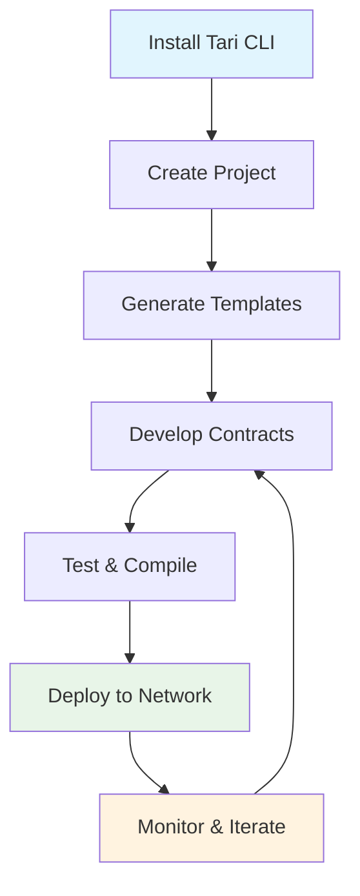

# 📚 Tari CLI Documentation

> **Complete documentation** for developing smart contracts on the Tari blockchain

Welcome to the comprehensive Tari CLI documentation! Whether you're new to smart contract development or an experienced blockchain developer, these guides will help you build powerful decentralized applications on Tari.

## 🚀 Quick Navigation

### 🎯 New to Tari CLI?
- **[Installation & Setup](01-getting-started/installation.md)** - Get Tari CLI installed and configured
- **[Quick Start Guide](01-getting-started/quick-start.md)** - Deploy your first smart contract in 10 minutes
- **[Development Workflow](01-getting-started/workflow.md)** - Learn the complete development cycle

### 📖 Essential Guides
- **[Template Development](02-guides/template-development.md)** - Create custom smart contract templates
- **[Project Configuration](02-guides/project-configuration.md)** - Configure projects and networks
- **[Deployment Guide](02-guides/deployment.md)** - Deploy contracts to blockchain networks

### 📋 Reference Materials
- **[CLI Commands](03-reference/cli-commands.md)** - Complete command reference with examples
- **[Configuration Schema](03-reference/configuration-schema.md)** - All configuration options
- **[API Patterns](03-reference/api-patterns.md)** - Real implementation patterns from codebase

### 🔧 Troubleshooting & Help
- **[Common Issues](04-troubleshooting/common-issues.md)** - Solutions to frequent problems
- **[Advanced Debugging](04-troubleshooting/debugging.md)** - Deep troubleshooting techniques
- **[FAQ](04-troubleshooting/faq.md)** - Frequently asked questions

### 🤝 Contributing
- **[Development Setup](05-contributing/development-setup.md)** - Set up development environment
- **[Testing Guide](05-contributing/testing.md)** - Test framework and best practices

## 🗺️ Documentation Map

```
📚 Tari CLI Documentation
├── 🚀 Getting Started
│   ├── Installation & Setup............. Complete environment setup
│   ├── Quick Start Guide................ First contract in 10 minutes  
│   └── Development Workflow............. Full development cycle
├── 📖 Guides
│   ├── Template Development............. Custom smart contract creation
│   ├── Project Configuration............ Network and project setup
│   └── Deployment Guide................ Blockchain deployment
├── 📋 Reference
│   ├── CLI Commands.................... Complete command reference
│   ├── Configuration Schema............ All config options
│   └── API Patterns.................... Real implementation examples
├── 🔧 Troubleshooting
│   ├── Common Issues................... Frequent problem solutions
│   ├── Advanced Debugging.............. Deep troubleshooting
│   └── FAQ............................. Frequently asked questions
└── 🤝 Contributing
    ├── Development Setup............... Contributor environment
    └── Testing Guide................... Test practices
```

## 🎯 Choose Your Path

### 🌟 I'm brand new to Tari
**Start here**: [Installation & Setup](01-getting-started/installation.md) → [Quick Start](01-getting-started/quick-start.md)

**You'll learn**: How to install Tari CLI, create your first project, and deploy a smart contract

### 🔨 I want to build custom templates  
**Start here**: [Template Development Guide](02-guides/template-development.md)

**You'll learn**: How to create reusable smart contract templates for specific use cases

### ⚙️ I need to configure complex setups
**Start here**: [Project Configuration](02-guides/project-configuration.md) → [Configuration Schema](03-reference/configuration-schema.md)

**You'll learn**: Advanced configuration for multiple networks, custom environments, and CI/CD

### 🚀 I'm ready to deploy to production
**Start here**: [Deployment Guide](02-guides/deployment.md)

**You'll learn**: Best practices for mainnet deployment, security considerations, and monitoring

### 🐛 I'm having issues
**Start here**: [Common Issues](04-troubleshooting/common-issues.md)

**You'll find**: Solutions to the most frequent problems and debugging techniques

### 🤝 I want to contribute
**Start here**: [Development Setup](05-contributing/development-setup.md)

**You'll learn**: How to set up a development environment and contribute to Tari CLI

## 🔄 Development Workflow Overview



**Typical Development Flow**:
1. **[Install](01-getting-started/installation.md)** - Set up development environment
2. **[Create](01-getting-started/quick-start.md#step-1-create-your-project)** - Initialize new project workspace
3. **[Generate](01-getting-started/quick-start.md#step-2-generate-your-first-smart-contract)** - Create smart contracts from templates
4. **[Develop](02-guides/template-development.md)** - Implement custom business logic
5. **[Test](01-getting-started/quick-start.md#step-4-test-compilation)** - Verify WASM compilation
6. **[Deploy](01-getting-started/quick-start.md#step-5-deploy-to-tari-network)** - Publish to blockchain
7. **[Monitor](02-guides/deployment.md#monitoring-deployments)** - Track performance and usage

## 📊 Documentation Quality

All documentation in this repository follows strict accuracy standards:

✅ **Verified Examples**: All code examples are extracted from actual test files or implementation  
✅ **Real Error Messages**: Error messages match actual CLI output  
✅ **Tested Commands**: All CLI commands are verified against current implementation  
✅ **Source References**: Major examples include source file references  
✅ **Regular Updates**: Documentation is updated with each release

## 🆘 Getting Help

### 📞 Quick Help
- **Installation Issues**: [Installation Guide](01-getting-started/installation.md#troubleshooting-installation)
- **Command Help**: Run `tari --help` or `tari <command> --help`
- **Configuration Problems**: [Common Issues](04-troubleshooting/common-issues.md#project-configuration-issues)

### 🤝 Community Support
- **🐛 Bug Reports**: [GitHub Issues](https://github.com/tari-project/tari-cli/issues)
- **💬 General Discussion**: [Tari Discord](https://discord.gg/tari)
- **❓ Questions**: [GitHub Discussions](https://github.com/tari-project/tari/discussions)

### 💡 Improve Documentation
Found something unclear or missing? We welcome contributions!

- **Quick Edits**: Use GitHub's edit button on any page
- **Major Changes**: See [Contributing Guide](05-contributing/development-setup.md)
- **Documentation Issues**: [Report documentation bugs](https://github.com/tari-project/tari-cli/issues/new?template=documentation.md)

## 🏆 Success Stories

**What you can build with Tari CLI**:
- **NFT Marketplaces**: Unique digital asset platforms
- **Token Systems**: Custom cryptocurrency implementations  
- **DeFi Protocols**: Decentralized finance applications
- **DAOs**: Decentralized autonomous organizations
- **Gaming Assets**: In-game items and economies

## 📈 Latest Updates

**Documentation Version**: Latest (main branch)  
**Last Major Update**: 2025-06-26  
**CLI Version Compatibility**: All current versions

**Recent Improvements**:
- ✨ Comprehensive CLI command reference
- ✨ Enhanced troubleshooting guides with verified solutions
- ✨ Step-by-step quick start workflow
- ✨ Visual workflow diagrams
- ✨ Real examples from test files

---

**Ready to start building?** Begin with our [Quick Start Guide](01-getting-started/quick-start.md) and deploy your first smart contract in minutes!
